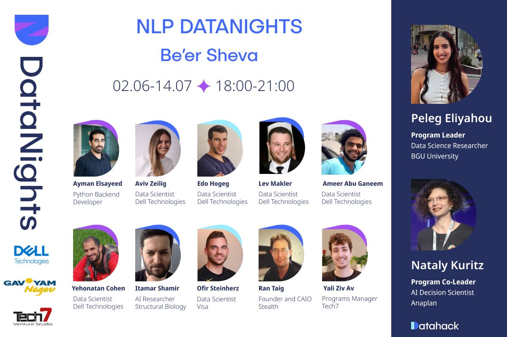

# Data Nights 2024

## Labs includes the following topics:

- [Introduction](labs-notebooks/lab-001.ipynb)
  - [Introduction to Pandas](labs-notebooks/IntroPandas.ipynb)
  - [Introduction to Seaborn](labs-notebooks/IntroSeaborn.ipynb)
  - [Introduction to Numpy](labs-notebooks/introNumpy.ipynb)
- [EDA](labs-notebooks/EDA.ipynb)
- [Data Cleaning](labs-notebooks/DataCleaning.ipynb)
- [Vectorizing Raw Data](labs-notebooks/VectorizingRawData.ipynb)
- [Neural Networks]()
  - [Introduction to Neural Networks](labs-notebooks/Neuron-Networks/Intro_NN.ipynb)

## Tasks includes the following:

- [Pandas tasks](Tasks/tasks-pandas.ipynb)
- [Seaborn tasks](Tasks/tasks-seaborn.ipynb)
- [EDA tasks](Tasks/tasks-EDA.ipynb)
- [Data Cleaning tasks](Tasks/tasks-DataCleaning.ipynb)
- [Vectorizing Raw Data tasks](Tasks/tasks-VectorizingRawData.ipynb)

## Projects includes the following:

- [Amazon Product Reviews](projects/Amazon_Product_Reviews.ipynb)
- [Twitter Sentiment Analysis](projects/Twitter_Sentiment_Analysis.ipynb)
- [Fake News Detection](projects/Fake_News_Classification.ipynb)